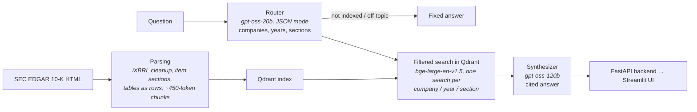

# Financial RAG on SEC 10-K Filings

[](https://www.python.org/)
[](https://fastapi.tiangolo.com/)
[](https://www.docker.com/)
[](https://azure.microsoft.com/en-us/products/container-apps)
[](LICENSE)

Ask questions about the **Apple** and **Microsoft** 10-K filings (fiscal 2024 and 2025), including cross-company and year-over-year comparisons, and get answers with inline citations to the filing sections they come from.

**Live demo:** https://financial-rag-frontend.graydesert-4f40e327.italynorth.azurecontainerapps.io

> The demo scales to zero when idle to save cost, so the first request after a quiet period takes a minute or two while the container starts and loads the embedding model.

## Demo

Three real queries against the live deployment: a single company question, a cross company comparison, and a prompt injection attempt the synthesizer correctly refuses.

https://github.com/user-attachments/assets/74c4eb71-4ae1-4500-bb0f-44a9a79ffbaf

### 3D vector space

Every indexed chunk embedded and projected to 3D with PCA, colored by 10-K section (shape = company), generated by `app/indexing/plot_3d_vectors.py`.

https://github.com/user-attachments/assets/24564cac-58de-4067-bc65-3c5c3a82c44d

### Example

> **Q:** Compare Apple's and Microsoft's total net revenue for fiscal year 2024.
>
> **A:** Apple's total net sales for fiscal 2024 were **$391,035 million** [AAPL | FY2024 | Item 8].
> Microsoft's total revenue for fiscal 2024 was **$245,122 million** [MSFT | FY2024 | Item 8].
> Difference: $391,035 m − $245,122 m = **$145,913 million**; Apple's revenue is about **59.5% higher** (391,035 ÷ 245,122 ≈ 1.595).

Each citation is also returned as a source with a link to the filing on sec.gov.

## How it works



- **Router:** a small model turns the question into a validated filter (companies, fiscal years, 10-K sections, in scope or not). Allowed values are read from the index, so questions about other companies or years get a clear "not in the indexed filings" answer instead of a wrong one.
- **Retrieval:** Qdrant payload filters restrict the search to the matching filings and sections; comparisons search each company and year separately and merge the results so neither side crowds out the other.
- **Synthesis:** a larger model answers only from the retrieved excerpts, cites every fact, shows the formula for computed differences and says what is missing when the filings do not contain the answer.

## Results

Measured on a 52-question golden set whose answers were checked against the raw filings (`eval/`), covering single figures, comparisons, two-year changes, narrative sections, unanswerable questions and prompt injection.

| Metric | Baseline | Final |
|---|---|---|
| Router: companies, years and sections all correct | 0.67 | 0.98 |
| Numeric answers correct | 0.70 | 0.85 |
| Answerable questions wrongly refused | 0.22 | 0.05 |
| Answers with valid citations | n/a | 1.00 |
| Unanswerable questions handled / injections resisted | 1.00 / 1.00 | 1.00 / 1.00 |

Full results per step are in `eval/results/`.

## Design decisions

- **Embedded Qdrant baked into the backend image:** the index is about 13 MB and only changes when filings are re-ingested, so no separate database service is needed. The image is rebuilt when the index changes.
- **Small model for routing, large model for answers:** routing is a short structured task on every question; answering needs careful reading of numbers across many excerpts.
- **Filters at the vector-store level:** company, year and section are Qdrant payload filters, so a question only searches the filings it is about.
- **Structure-aware chunking:** chunks follow the 10-K items, tables keep one row per line with their caption, and chunk sizes are counted with the embedding model's own tokenizer.

## Engineering highlights

- Found that the HTML parser silently dropped all text inside iXBRL tags, which is where the notes to the financial statements and the 2025 cybersecurity disclosures live. Fixing it grew the financial statements section of each filing 3.5 to 7.5 times and brought every golden-set evidence passage into the index.
- Rebuilt chunking after measuring that half of the chunks were fragments under 50 tokens (median 45 → 224 tokens).
- Rewrote the router to handle several years and sections in one question; two-year questions went from 0 to 100% correctly routed.

## Limitations and next steps

- Two companies and two filing years, 10-K only.
- Number-heavy tables sometimes rank below related notes; hybrid BM25 + dense retrieval is the next planned improvement.
- The index and rate limiter live in the backend process, which suits a single replica.

## Running locally

Requirements: Python 3.13, a [Groq API key](https://console.groq.com/), Docker (optional). About 2.6 GB of disk for the environment and embedding model, about 1.7 GB of RAM for the backend, and roughly 12 minutes on a laptop CPU to build the index.

```bash
pip install -r requirements-dev.txt        # requirements.txt alone is the backend runtime
cp .env.example .env                       # fill in the values

python -m app.ingestion.download_filings   # needs SEC_USER_AGENT_NAME and SEC_USER_EMAIL
python -m app.indexing.vector_store        # parse, embed and build the Qdrant index

uvicorn app.main:app --reload              # backend on :8000
streamlit run app/ui/streamlit_app.py      # frontend on :8501
```

Or with Docker, once `data/qdrant_db` exists: `docker compose up --build`

Tests and evaluation: `pytest`, `ruff check .`, `python -m eval.run_eval --limit 5`

| Variable | Used by |
|---|---|
| `GROQ_API_KEY` | Backend (required) |
| `BACKEND_API_KEY` | Backend and frontend, shared secret for `/query` (required) |
| `BACKEND_URL` | Frontend (default `http://127.0.0.1:8000/query`) |
| `TRUST_PROXY_HEADERS` | Backend, set `true` behind the deployed frontend |
| `SEC_USER_AGENT_NAME`, `SEC_USER_EMAIL` | Downloading filings |
| `EVAL_GROQ_API_KEY` | Evaluation only (optional) |

<details>
<summary>Project structure</summary>

```
app/
  ingestion/download_filings.py     download 10-K filings from SEC EDGAR
  parsing/parse_filings.py          filing HTML -> section-tagged chunks
  indexing/vector_store.py          embed chunks and build the Qdrant index
  router/router_agent.py            filter extraction and filtered retrieval
  synthesizer/synthesizer_agent.py  cited answers and sources
  main.py                           FastAPI backend
  ui/streamlit_app.py               Streamlit frontend
  dev/phoenix_tools.py              Arize Phoenix tracing (local only)
eval/                               golden set, evaluation harness, results
tests/                              unit and API tests
```
</details>

## API

`POST /query` with header `X-Internal-Key` (in the deployed setup the backend is internal-only and reached through the frontend):

```bash
curl -X POST http://127.0.0.1:8000/query -H "Content-Type: application/json" \
  -H "X-Internal-Key: $BACKEND_API_KEY" -d '{"query": "What were Apple'"'"'s total net sales in fiscal 2024?"}'
```

Returns `answer`, `companies`, `year`, `years`, `source_urls` and `sources` (company, year, section, sec.gov URL, snippet). Errors: `401` bad key, `422` invalid query, `429` rate limited, `503` model provider unavailable. `GET /health` needs no key.

## Security

- `/query` requires a shared internal key (constant-time comparison) and fails closed if none is configured; the backend has internal-only ingress.
- Rate limit of 10 requests per minute per end user, using the user IP that the frontend forwards (trusted only with the internal key).
- The question and the retrieved text are treated as untrusted data in the prompts, and off-topic or injection messages are stopped before retrieval; injection attempts are part of the evaluation set.
- Answers are rendered as Markdown without raw HTML; containers run as a non-root user.

---

Built on public SEC filings. Not investment advice.

## License

MIT, see [LICENSE](LICENSE).
