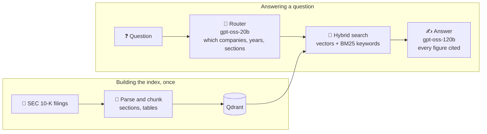
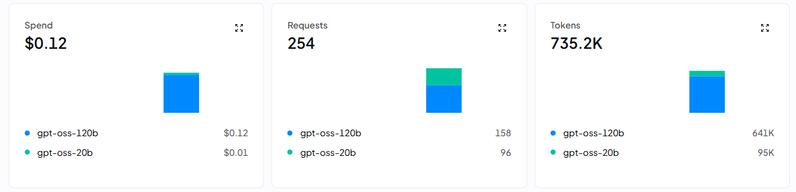

# Financial RAG on SEC 10-K Filings

[](https://www.python.org/)
[](https://fastapi.tiangolo.com/)
[](https://www.docker.com/)
[](https://azure.microsoft.com/en-us/products/container-apps)
[](https://openrouter.ai/)
[](LICENSE)

Ask plain-English questions about the annual reports of **Apple, Microsoft, NVIDIA, Alphabet, Amazon and Meta** (fiscal 2024 and 2025) and get answers where every figure links to the page of the filing it comes from.

⚡ 2–5 s per answer · 💰 about $0.001 per question · 🎯 97% of numeric answers correct on a 62-question test set

🔗 **Live demo:** https://financial-rag-frontend.graydesert-4f40e327.italynorth.azurecontainerapps.io
<sub>The demo sleeps when idle to save cost, so the first visit after a quiet period takes a minute to wake up.</sub>

## 🎬 Demo


https://github.com/user-attachments/assets/101a7e50-8601-40d2-bcb2-f73496490db2


### 3D vector space

The indexed chunks projected to 3D and colored by 10-K section, recorded with the first two-company index (`app/indexing/plot_3d_vectors.py` draws the current one).

https://github.com/user-attachments/assets/24564cac-58de-4067-bc65-3c5c3a82c44d

## 💬 Example

> **Q:** Compare NVIDIA's and Meta's net income for fiscal year 2025.
>
> **A:** NVIDIA net income FY 2025: **$72,880 million** [NVDA | FY2025 | Item 15]
> Meta net income FY 2025: **$60,458 million** [META | FY2025 | Item 8]
> Difference: 72,880 − 60,458 = 12,422 million, so NVIDIA's net income was about **$12.4 billion higher** (≈ 20.6%).
>
> Fiscal years end on different dates: META FY2025 ended December 31, 2025 · NVDA FY2025 ended January 26, 2025.

## ⚙️ How it works



- **Router:** a small model reads the question and decides which companies, fiscal years and 10-K sections to search. Questions about other companies, other years or other topics get a clear refusal.
- **Hybrid search:** each filing is searched by meaning and by exact keywords, and the results are merged, so both paraphrased questions and exact terms like "operating income" find the right passage.
- **Answer:** a larger model answers only from the retrieved excerpts and cites every figure; the app turns citations into links to the cited passage on sec.gov.

## 📊 Results

Measured on a 62-question test set whose answers were checked against the filings (`eval/`). Baseline and the two-company column use the first 52 questions.

| Metric | Baseline | 2 companies | 6 companies | 6 companies, hybrid search |
|---|---|---|---|---|
| Router: companies, years and sections all correct | 0.67 | 0.98 | 0.97 | 0.97 |
| Evidence retrieved (hit@k) | 0.59 | 0.81 | 0.80 | 0.86 |
| Rank of the evidence (MRR) | 0.41 | 0.54 | 0.49 | 0.68 |
| Numeric answers correct | 0.70 | 0.85 | 0.89 | 0.97 |
| Answerable questions wrongly refused | 0.22 | 0.05 | 0.06 | 0.02 |
| Answers with valid citations | n/a | 1.00 | 1.00 | 0.98 |
| Unanswerable questions handled / injections resisted | 1.00 / 1.00 | 1.00 / 1.00 | 1.00 / 1.00 | 1.00 / 1.00 |

Adding keyword search next to vector search moved the right excerpt to the top far more often and took numeric accuracy from 0.89 to 0.97.

### 💰 Cost

254 model calls, including two full evaluation runs and all testing, cost $0.12 on OpenRouter: about $0.001 per question, almost all of it for the answering model.



## 💡 Design decisions

- **Small model for routing, large model for answers:** routing is a short structured task; answering needs careful reading of numbers.
- **Filters before search:** company, year and section are Qdrant payload filters, so a question only searches the filings it is about.
- **Index baked into the image:** the index is about 50 MB and changes only when filings are added, so no separate database is needed.
- **Low cost by design:** an answer cache for repeated questions, a daily cap on new answers and a prepaid model budget with a spending limit.
- **Untrusted input:** questions and filing text are treated as data in the prompts, and prompt injection attempts are part of the test set.

## 🛠️ Engineering highlights

- Found that the HTML parser silently dropped all text inside iXBRL tags, where the notes to the financial statements live; fixing it grew each filing's financial statements section 3.5 to 7.5 times.
- Going from two to six companies first dropped retrieval from 0.81 to 0.69. Automatic parse checks and a separate search over the main financial statements found and fixed the causes (Amazon's headings laid out as tables, NVIDIA's statements in Item 15, empty page-header tables).
- Moved from Groq's free tier (about one question per minute) to OpenRouter with a prepaid limit, pinned to the fastest hosts after measuring that the default routing made answers up to 5 times slower.

## 🚀 Run locally

Needs Python 3.13 and an [OpenRouter](https://openrouter.ai/keys) or [Groq](https://console.groq.com/) API key.

```bash
pip install -r requirements-dev.txt
cp .env.example .env                       # add your keys
python -m app.ingestion.download_filings   # download the 10-K filings
python -m app.indexing.vector_store        # build the index (about 45 minutes on a laptop CPU)
uvicorn app.main:app                       # backend on :8000
streamlit run app/ui/streamlit_app.py      # frontend on :8501
```

Or with Docker, once the index exists: `docker compose up --build`. Tests: `pytest`, evaluation: `python -m eval.run_eval`.

<details>
<summary>Environment variables</summary>

| Variable | Purpose |
|---|---|
| `LLM_PROVIDER` | `openrouter` or `groq` (default) |
| `OPENROUTER_API_KEY` / `GROQ_API_KEY` | Key for the chosen provider |
| `BACKEND_API_KEY` | Shared secret between frontend and backend |
| `BACKEND_URL` | Where the frontend sends questions (default `http://127.0.0.1:8000/query`) |
| `TRUST_PROXY_HEADERS` | `true` on the deployed backend, for per-user rate limits |
| `DAILY_ANSWER_LIMIT` | New answers per day (default 50) |
| `SEC_USER_AGENT_NAME`, `SEC_USER_EMAIL` | Required by SEC EDGAR for downloads |
</details>

<details>
<summary>Project structure</summary>

```
app/
  ingestion/     download 10-K filings from SEC EDGAR
  parsing/       filing HTML -> section-tagged chunks
  indexing/      embed chunks, build the Qdrant index, 3D plot
  router/        question routing, vector and keyword search
  synthesizer/   cited answers and sources
  main.py        FastAPI backend
  ui/            Streamlit frontend
eval/            test set, evaluation harness, results
tests/           unit and API tests
```
</details>

---

Built on public SEC filings. Not investment advice. MIT license, see [LICENSE](LICENSE).
