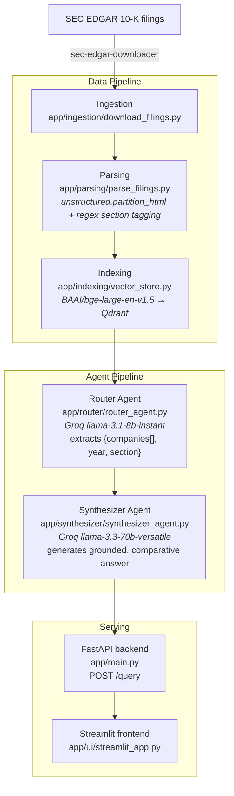

# Multi Agent Financial RAG System

A Retrieval Augmented Generation system that answers questions about **Apple (AAPL)** and **Microsoft (MSFT)** SEC 10-K filings including side by side comparisons using a two agent LLM pipeline (routing + synthesis) over a locally embedded, metadata filtered Qdrant vector store.

**Live demo:** https://financial-rag-frontend.graydesert-4f40e327.italynorth.azurecontainerapps.io

> Runs on Azure Container Apps' consumption plan, which scales to zero when idle. The first request after a period of inactivity can take 1-2 minutes to wake up that's infrastructure cold start, not the model being slow.

## What it does

Ask a question like:

- *"Compare Apple's and Microsoft's total net revenue for fiscal year 2024."*
- *"What were Apple's primary risk factors in 2024?"*
- *"What were Microsoft's primary cybersecurity risks in 2024?"*

The system extracts which company/companies, fiscal year, and 10-K section (Item 1, 1A, 7, 8, etc.) the question is about, retrieves only the matching filing chunks from Qdrant, and synthesizes a grounded answer with links back to the source filing on SEC EDGAR.

## Demo

Three real queries against the live deployment: a single company question, a cross company comparison, and a prompt injection attempt the synthesizer correctly refuses.

https://github.com/user-attachments/assets/74c4eb71-4ae1-4500-bb0f-44a9a79ffbaf

## 3D Vector Space Explorer

Every indexed chunk's embedding, PCA reduced to 3D and colored by 10-K section (shape = company). Clusters show semantically similar content grouping together even across companies; hovering a point reveals its full metadata (company, year, section). Generated by `app/indexing/plot_3d_vectors.py`.

https://github.com/user-attachments/assets/24564cac-58de-4067-bc65-3c5c3a82c44d

## Architecture



Tracing/observability across the router and synthesizer calls is instrumented with **Arize Phoenix** (local dashboard, not part of the deployed containers).

## Tech stack

| Layer          | Choice                                              |
|----------------|------------------------------------------------------|
| Orchestration  | LlamaIndex                                          |
| Vector DB      | Qdrant (embedded, on disk)                          |
| Embeddings     | `BAAI/bge-large-en-v1.5`, run locally on CPU        |
| Router LLM     | Groq `llama-3.1-8b-instant`                         |
| Synthesizer LLM| Groq `llama-3.3-70b-versatile`                      |
| Backend        | FastAPI + Uvicorn, rate limited (`slowapi`), internal key auth |
| Frontend       | Streamlit                                           |
| Deployment     | Docker → Azure Container Apps (via ACR)             |

## Security notes

- The backend is deployed with **internal only ingress** it isn't reachable directly from the internet, only from the frontend container inside Azure's environment.
- Every `/query` request from the frontend must carry a shared `X-Internal-Key` header, checked with a constant time comparison (`secrets.compare_digest`) to avoid timing attacks.
- Per IP rate limiting (10 requests/minute) via `slowapi`.
- The router's system prompt explicitly frames the user's message as untrusted data to extract fields from, not instructions to follow, to reduce (not eliminate) prompt injection risk.
- The Streamlit UI HTML escapes the LLM's answer before rendering it, since the answer is displayed via `unsafe_allow_html=True` otherwise injected `<script>` or stray markup in a synthesized answer would execute as live HTML.

## Running locally

Requirements: Python 3.13, Docker (optional, for the containerized path), a [Groq API key](https://console.groq.com/).

### Option A plain Python

```bash
pip install -r requirements.txt

# 1. Download filings (AAPL, MSFT 10-Ks)
python app/ingestion/download_filings.py

# 2. Parse into section tagged nodes
python app/parsing/parse_filings.py

# 3. Embed + build the local Qdrant index (~10-15 min on CPU)
python app/indexing/vector_store.py

# 4. Run the backend
uvicorn app.main:app --reload

# 5. Run the frontend (separate terminal)
streamlit run app/ui/streamlit_app.py
```

Environment variables (`.env`, not committed):

```
GROQ_API_KEY=...
BACKEND_API_KEY=...        # shared secret between frontend and backend
BACKEND_URL=http://127.0.0.1:8000/query   # set on the frontend
```

### Option B Docker Compose

```bash
docker-compose up --build
```

Builds `Dockerfile.backend` (FastAPI + baked in Qdrant index) and `Dockerfile.frontend` (Streamlit), and wires them together with `BACKEND_URL=http://backend:8000/query`. The Qdrant index must already exist at `./data/qdrant_db` before building it's baked into the backend image rather than mounted, since Azure Container Apps has no persistent volume equivalent.

## License

MIT — see [LICENSE](LICENSE).
