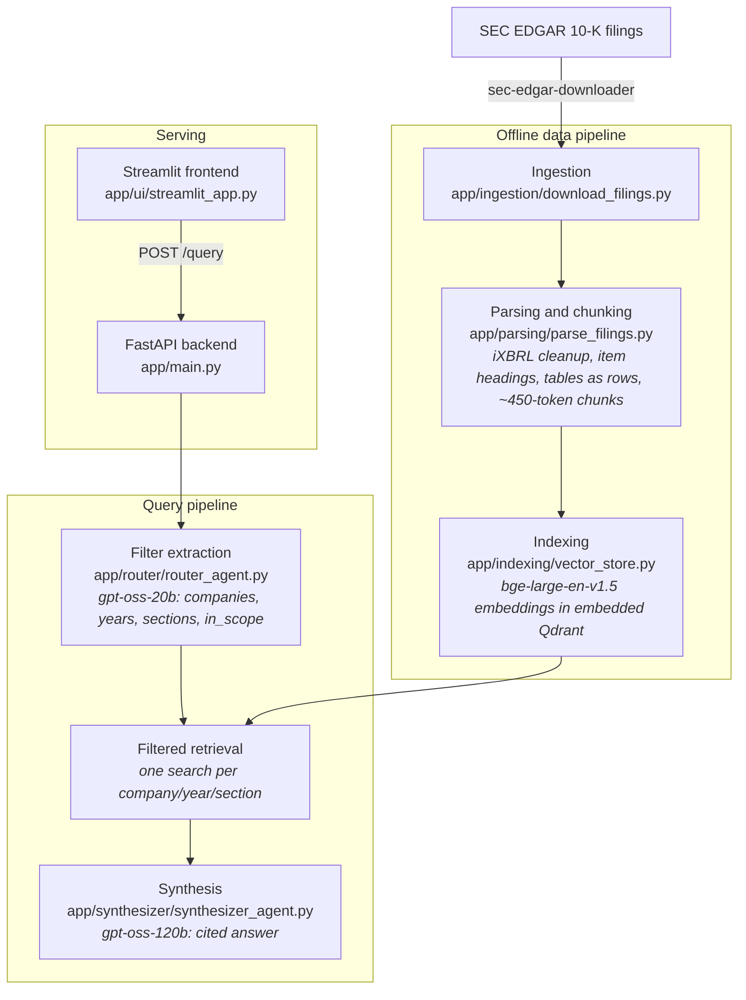

# Financial RAG on SEC 10-K Filings

[](https://www.python.org/)
[](https://fastapi.tiangolo.com/)
[](https://www.docker.com/)
[](https://azure.microsoft.com/en-us/products/container-apps)
[](LICENSE)

Answers questions about the **Apple (AAPL)** and **Microsoft (MSFT)** 10-K filings for fiscal years 2024 and 2025, including cross-company and year-over-year comparisons, with inline citations to the filing sections used.

**Live demo:** https://financial-rag-frontend.graydesert-4f40e327.italynorth.azurecontainerapps.io

> The demo runs on Azure Container Apps with scale-to-zero to stay within a limited student budget. The first request after an idle period starts a new container, which also loads the embedding model and the index, so it can take one to two minutes. Later requests take a few seconds.

## Demo

Three real queries against the live deployment: a single company question, a cross company comparison, and a prompt injection attempt the synthesizer correctly refuses.

https://github.com/user-attachments/assets/74c4eb71-4ae1-4500-bb0f-44a9a79ffbaf

### Example

From the evaluation run (`eval/results/step6_synthesizer.json`, question `cmp-01`):

> **Q:** Compare Apple's and Microsoft's total net revenue for fiscal year 2024.
>
> **A:** Apple's total net sales for fiscal 2024 were **$391,035 million** [AAPL | FY2024 | Item 8].
> Microsoft's total revenue for fiscal 2024 was **$245,122 million** [MSFT | FY2024 | Item 8].
>
> - Difference: $391,035 m − $245,122 m = **$145,913 million**.
> - Apple's 2024 revenue is about **59.5% higher** than Microsoft's (391,035 ÷ 245,122 ≈ 1.595).
>
> **Analysis:** Apple generated substantially more revenue than Microsoft in FY 2024.

Each citation is returned in `sources` with a link to the filing document, for example [AAPL FY2024 10-K](https://www.sec.gov/Archives/edgar/data/320193/000032019324000123/aapl-20240928.htm) and [MSFT FY2024 10-K](https://www.sec.gov/Archives/edgar/data/789019/000095017024087843/msft-20240630.htm).

## Evaluation

`eval/` holds a golden set of 52 questions whose reference values and evidence passages were checked against the raw filings (`python -m eval.verify_golden_set`): single-company figures, cross-company and two-year comparisons, narrative sections (risk factors, cybersecurity, legal proceedings, MD&A, business), unanswerable questions and prompt-injection attempts. `python -m eval.run_eval` scores every stage; LLM calls run at temperature 0 and are cached on disk.

| Metric | Baseline | Final |
|---|---|---|
| Filter extraction fully correct | 0.67 | 0.98 |
| Retrieval MRR | 0.41 | 0.54 |
| Numeric answers correct | 0.70 | 0.85 |
| Answerable questions wrongly refused | 0.22 | 0.05 |
| Answers with a valid citation | n/a | 1.00 |
| Unanswerable questions handled | 1.00 | 1.00 |
| Prompt injections resisted | 1.00 | 1.00 |
| Golden-set evidence passages present in the index | 48 of 51 | 51 of 51 |

Baseline: the original pipeline (with the retired Llama models swapped for the current ones). Final: `eval/results/step6_synthesizer.md`.

Notes on reading these numbers:
- Retrieval hit rate is measured against one evidence passage per fact. Since the notes to the financial statements were indexed, the same figure often also appears in a note or in MD&A, so a correct answer can count as a retrieval miss; MRR and answer-level metrics are the more reliable signals.
- Synthesis metrics still vary a little between runs even at temperature 0.
- The full per-step history (baseline, router rewrite, parsing, synthesis) is in `eval/results/`.

## How it works

A question goes through two LLM calls with retrieval in between. This is a two-stage pipeline, not a multi-agent system:

1. **Filter extraction (self-querying retrieval).** A small model (`openai/gpt-oss-20b` on Groq, JSON mode, temperature 0) turns the question into a validated filter: companies, fiscal years, 10-K sections, and whether the question is in scope. Allowed values are read from the index at startup. Questions about companies or years that are not indexed, and off-topic or prompt-injection messages, get a fixed answer without retrieval.
2. **Retrieval.** One Qdrant search per (company, year, section) combination with payload filters, using a single query embedding (`BAAI/bge-large-en-v1.5`, run locally). Results are deduplicated, interleaved so that one company cannot crowd out the other in a comparison, and capped at 16 chunks / 16,000 characters.
3. **Synthesis.** A larger model (`openai/gpt-oss-120b` on Groq) answers only from the retrieved excerpts, cites every fact as `[AAPL | FY2024 | Item 8]`, shows the formula for any computed difference, and says explicitly what is missing when the excerpts do not contain the answer. The API returns the cited excerpts as `sources` with links to the filing documents on sec.gov.



## Design decisions

- **Embedded Qdrant baked into the image.** The index is small (about 13 MB) and changes only when filings are re-ingested, and Azure Container Apps has no local persistent volume, so the backend image ships with the index instead of using a separate vector database service. Trade-off: the image must be rebuilt and pushed whenever the index changes.
- **Small model for filters, large model for answers.** Filter extraction is a short, structured task and runs on every question, so it uses the smaller and faster model with low reasoning effort; the answer needs reading many excerpts and careful numbers, so it uses the larger model.
- **Metadata filters at the vector-store level.** Company, year and section are payload filters inside Qdrant, so a question about Apple's 2024 financial statements only searches those chunks. A Qdrant filter can only AND exact matches, so comparisons run one search per combination and merge the results.
- **Structure-aware chunking.** Chunks follow the 10-K item structure, tables become one row per line with their caption, and small paragraphs are merged up to about 450 tokens (counted with the embedding model's own tokenizer). Before this, half of the chunks were under 50 tokens and the notes to the financial statements and the 2025 cybersecurity sections were missing because the parser dropped text inside iXBRL tags.
- **bge-large-en-v1.5 embeddings run locally.** Chosen for retrieval quality and to avoid sending filing text to an embedding API; the cost is a 1.3 GB model that the backend loads at startup. It was not benchmarked against other embedding models in this repository.

## Engineering notes

Problems found while measuring the system, and what changed:

- **The parser silently dropped the notes to the financial statements.** Inline XBRL wraps tagged text blocks (all notes, and since 2025 the Item 1C cybersecurity disclosure) in `ix:nonNumeric` elements, and `unstructured.partition_html` discarded their content. It surfaced when the golden-set checker found evidence passages that existed in the raw filings but not in the index. Unwrapping the tags before parsing raised Item 8 from about 18k to 64k characters per Apple filing and from 14-18k to 105-116k per Microsoft filing.
- **Half of the chunks were fragments.** One chunk per HTML element gave a median of 45 tokens, with page footers and table-of-contents lines among them. Merging paragraphs within a section and dropping running headers and footers for both companies brought the median to 224 tokens and halved the chunk count.
- **Table-of-contents lines and missing item headings mislabeled sections.** Content after Item 9A (Part III, exhibits) was tagged as Item 9A. Headings now count only where they are followed by real content, and every item is labeled.
- **The filter extractor could only hold one year and one section,** so year-over-year questions lost one side, and an unsupported year was silently dropped, which led to answers about the wrong year. Lists of years and sections, plus an explicit "not in the indexed filings" answer, fixed both (two-year filter accuracy 0.00 to 1.00).
- **The hosted models were retired.** Both Llama models the project used were removed from Groq, so every query failed; the pipeline now runs on `gpt-oss-20b` and `gpt-oss-120b`, re-measured on the same golden set.
- **Serving fixes.** The endpoint blocked the event loop during the LLM calls, and behind the frontend the per-IP rate limit was effectively one bucket for all users.

## Known limitations

- Two companies, the two most recent 10-K filings each (fiscal 2024 and 2025), 10-K only. Earlier years are available only as comparative columns in those filings.
- Numeric answers can still be wrong; check the cited sources.
- Embedded Qdrant and the rate limiter both live in the backend process, which suits a single replica only.
- Scale-to-zero (a cost choice) means the first request after idle waits for a container start and the model load.
- The Groq free tier limits tokens per minute and per day, which caps throughput.

## Next steps

- Hybrid retrieval (BM25 fused with dense search) or a cross-encoder reranker, to rank number-heavy tables such as the income statement higher inside the large Item 8 section.
- Score retrieval against all passages that contain a fact, not one evidence passage per fact.
- Use the XBRL facts in each filing for exact figures instead of reading them from text.
- More companies and filing years.
- A shared store for rate limiting if the backend ever runs more than one replica.

## Running locally

### Project structure

```
app/
  ingestion/download_filings.py   download 10-K filings from SEC EDGAR
  parsing/parse_filings.py        filing HTML -> section-tagged, ~450-token chunks
  indexing/vector_store.py        embed chunks and build the Qdrant index
  router/router_agent.py          filter extraction and filtered retrieval
  synthesizer/synthesizer_agent.py  cited answer generation and sources
  main.py                         FastAPI backend
  ui/streamlit_app.py             Streamlit frontend
  dev/phoenix_tools.py            local tracing and interactive session (dev only)
eval/                             golden set, evaluation harness, results
tests/                            unit and API tests (no network)
```

| Requirement | Notes |
|---|---|
| Python | 3.13 |
| Docker | Optional, for the containerized setup |
| Groq API key | https://console.groq.com/ |
| SEC contact identity | Your name and email for the SEC fair-access policy, only needed to download filings |
| Disk | Approximately 2.6 GB for the full development environment, 1.3 GB for the embedding model, 98 MB of raw filings, 13 MB index |
| RAM | Approximately 1.7 GB for the backend once it has answered a query (about 0.6 GB right after startup, since the model weights load lazily) |
| Indexing time | Approximately 12 minutes on a laptop CPU |

```bash
pip install -r requirements-dev.txt   # requirements.txt alone is the backend runtime
cp .env.example .env                  # then fill in the values

python -m app.ingestion.download_filings   # download the 10-K filings
python -m app.parsing.parse_filings        # optional: print per-section chunk statistics
python -m app.indexing.vector_store        # parse, embed and build the Qdrant index

uvicorn app.main:app --reload              # backend on http://127.0.0.1:8000
streamlit run app/ui/streamlit_app.py      # frontend on http://localhost:8501 (second terminal)
```

With Docker (the index must exist in `data/qdrant_db` first, since it is copied into the backend image):

```bash
docker compose up --build
```

Tests and evaluation:

```bash
pytest                                  # no network or LLM calls
ruff check .
python -m eval.verify_golden_set --index
python -m eval.run_eval --limit 5       # calls Groq; answers are cached in eval/.cache
```

### Environment variables

| Name | Required | Used by |
|---|---|---|
| `GROQ_API_KEY` | Yes | Backend, evaluation |
| `BACKEND_API_KEY` | Yes | Backend and frontend (shared secret for `/query`) |
| `BACKEND_URL` | No (default `http://127.0.0.1:8000/query`) | Frontend |
| `TRUST_PROXY_HEADERS` | No (default `false`) | Backend: rate-limit by the end-user IP the frontend forwards |
| `SEC_USER_AGENT_NAME`, `SEC_USER_EMAIL` | Only for ingestion | `app/ingestion/download_filings.py` |

## API

In the deployed setup the backend has internal-only ingress and is reachable only from the frontend; every `/query` request needs the `X-Internal-Key` header.

`POST /query`

```bash
curl -X POST http://127.0.0.1:8000/query \
  -H "Content-Type: application/json" \
  -H "X-Internal-Key: $BACKEND_API_KEY" \
  -d '{"query": "How did Apple'"'"'s net income change between fiscal 2024 and fiscal 2025?"}'
```

```json
{
  "answer": "... [AAPL | FY2025 | Item 8] ...",
  "companies": ["AAPL"],
  "year": null,
  "years": ["2024", "2025"],
  "source_urls": {"AAPL": "https://www.sec.gov/cgi-bin/browse-edgar?action=getcompany&CIK=AAPL&type=10-K"},
  "sources": [
    {"company": "AAPL", "year": "2025", "section": "Item 8",
     "url": "https://www.sec.gov/Archives/edgar/data/320193/000032019325000079/aapl-20250927.htm",
     "snippet": "Table: CONSOLIDATED STATEMENTS OF ..."}
  ]
}
```

`query` must be 1 to 500 characters. `year` is set only when the question is about a single fiscal year. Errors: `401` missing or wrong key, `422` invalid query, `429` rate limit (this API's or the model provider's), `503` model provider unavailable, `502` other failures.

`GET /health` (no key, not rate limited): `{"status": "ok", "index_loaded": true}`

## Security notes

- The backend accepts `/query` only with the shared `X-Internal-Key`, compared in constant time; if the key is not configured the endpoint fails closed with `503`.
- Rate limit: 10 requests per minute per end user. The frontend forwards the user's IP in `X-End-User-IP`, and the backend trusts it only when `TRUST_PROXY_HEADERS=true` and the request carries the valid internal key; otherwise it uses the connection IP. The limiter state is in process memory, so it resets on restart and is not shared between replicas.
- The question and the retrieved excerpts are both treated as untrusted data in the prompts (separate tags, explicit instructions to ignore embedded commands), and off-topic or injection messages are stopped before retrieval. This reduces prompt injection risk but does not eliminate it; injection attempts are part of the evaluation set.
- The frontend renders answers as Markdown without raw HTML, and error messages do not expose backend details.
- Containers run as a non-root user.

## Appendix: 3D vector space explorer

Every indexed chunk's embedding, PCA reduced to 3D and colored by 10-K section (shape = company). Generated by `app/indexing/plot_3d_vectors.py`.

https://github.com/user-attachments/assets/24564cac-58de-4067-bc65-3c5c3a82c44d

---

Built on public SEC filings. Answers can be wrong and are not investment advice.

## License

MIT, see [LICENSE](LICENSE).
