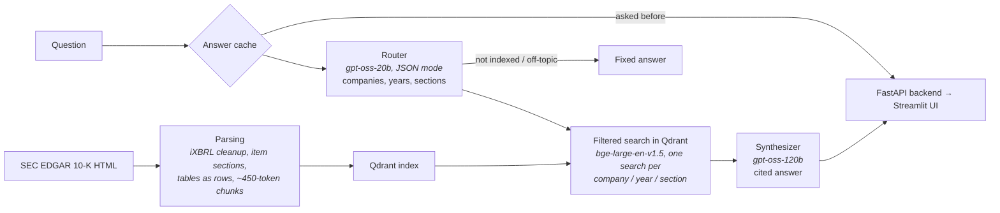

# Financial RAG on SEC 10-K Filings

[](https://www.python.org/)
[](https://fastapi.tiangolo.com/)
[](https://www.docker.com/)
[](https://azure.microsoft.com/en-us/products/container-apps)
[](https://openrouter.ai/)
[](LICENSE)

Ask questions about the 10-K filings of **Apple, Microsoft, NVIDIA, Alphabet, Amazon and Meta** (fiscal 2024 and 2025), including cross-company and year-over-year comparisons, and get answers with inline citations that link to the cited passage on sec.gov.

**Stack:** LlamaIndex · Qdrant · bge-large-en-v1.5 embeddings · gpt-oss-20b / gpt-oss-120b via OpenRouter · FastAPI · Streamlit · Docker · Azure Container Apps

**Live demo:** https://financial-rag-frontend.graydesert-4f40e327.italynorth.azurecontainerapps.io

> The demo scales to zero when idle to save cost, so the first request after a quiet period takes a minute or two while the container starts and loads the embedding model.

## Demo

Three real queries against the live deployment: a single company question, a cross company comparison, and a prompt injection attempt the synthesizer correctly refuses. (Recorded with the earlier two-company version; the current site covers six companies and has a new interface.)

https://github.com/user-attachments/assets/74c4eb71-4ae1-4500-bb0f-44a9a79ffbaf

### 3D vector space

All 3,913 indexed chunks of the 12 filings, embedded and projected to 3D with PCA and colored by 10-K section, generated by `app/indexing/plot_3d_vectors.py` (the interactive version shows the company and text of each point on hover). In the full 1,024-dimension space, 77% of each chunk's 10 nearest neighbors come from the same section and 82% from the same company (28% and 18% by chance), so both what a passage is about and who wrote it shape the embedding; this is why searches are filtered by company and section rather than relying on similarity alone.

https://github.com/user-attachments/assets/24564cac-58de-4067-bc65-3c5c3a82c44d

### Example

> **Q:** Compare NVIDIA's and Meta's net income for fiscal year 2025.
>
> **A:** NVIDIA net income FY 2025: **$72,880 million** [NVDA | FY2025 | Item 15]
> Meta net income FY 2025: **$60,458 million** [META | FY2025 | Item 8]
> Difference: 72,880 − 60,458 = 12,422 million, so NVIDIA's net income was about **$12.4 billion higher** (≈ 20.6%).
>
> Fiscal years end on different dates: META FY2025 ended December 31, 2025 · NVDA FY2025 ended January 26, 2025.

In the app the citations become numbered chips, and each source links to the cited table or paragraph on sec.gov. NVIDIA's figures come from Item 15, where its 10-K keeps the financial statements.

## How it works



- **Router:** a small model turns the question into a validated filter (companies, fiscal years, 10-K sections, in scope or not). Allowed values are read from the index, so questions about other companies or years get a clear "not in the indexed filings" answer instead of a wrong one.
- **Retrieval:** Qdrant payload filters restrict the search to the matching filings and sections; comparisons search each company and year separately and merge the results so neither side crowds out the other. For financial statement questions the primary statements (income statement, balance sheet, cash flows) of each filing are also searched on their own, so headline figures are not buried under notes.
- **Synthesis:** a larger model answers only from the retrieved excerpts, cites every fact, shows the formula for computed differences and says what is missing when the filings do not contain the answer. When companies with different fiscal year ends are compared, the answer notes the dates.
- **Models:** both are open-weight gpt-oss models, served through OpenRouter (preferring Groq and Cerebras hosts for speed) or directly by Groq, chosen with `LLM_PROVIDER`.

## Results

Measured on a 62-question golden set whose answers were checked against the raw filings (`eval/`), covering single figures, comparisons, two-year changes, narrative sections, unanswerable questions and prompt injection. Baseline and the two-company column use the first 52 questions (Apple and Microsoft only).

| Metric | Baseline | 2 companies | 6 companies |
|---|---|---|---|
| Router: companies, years and sections all correct | 0.67 | 0.98 | 0.97 |
| Evidence retrieved (hit@k) | 0.59 | 0.81 | 0.80 |
| Numeric answers correct | 0.70 | 0.85 | 0.89 |
| Answerable questions wrongly refused | 0.22 | 0.05 | 0.06 |
| Answers with valid citations | n/a | 1.00 | 1.00 |
| Unanswerable questions handled / injections resisted | 1.00 / 1.00 | 1.00 / 1.00 | 1.00 / 1.00 |

Going from two to six companies first dropped retrieval to 0.69: in large financial statement sections the number-heavy statements ranked below notes that mention the same items. Searching the primary statements of each filing separately, and skipping empty page-header tables, brought it back.

Full results per step are in `eval/results/`.

## Design decisions

- **Embedded Qdrant baked into the backend image:** the index is about 50 MB and only changes when filings are re-ingested, so no separate database service is needed. The image is rebuilt when the index changes.
- **Cost control:** repeated questions are answered from an in-memory cache, new answers are capped per day, and the model provider has a prepaid spending limit; a question costs about $0.001.
- **Small model for routing, large model for answers:** routing is a short structured task on every question; answering needs careful reading of numbers across many excerpts.
- **Filters at the vector-store level:** company, year and section are Qdrant payload filters, so a question only searches the filings it is about.
- **Structure-aware chunking:** chunks follow the 10-K items, tables keep one row per line with their caption, and chunk sizes are counted with the embedding model's own tokenizer.

## Engineering highlights

- Found that the HTML parser silently dropped all text inside iXBRL tags, where the notes to the financial statements and the 2025 cybersecurity disclosures live; fixing it grew each filing's financial statements section 3.5 to 7.5 times. Rebuilt chunking at the same time after measuring that half of the chunks were fragments under 50 tokens (median 45 → 224 tokens).
- Rewrote the router to handle several years and sections in one question; two-year questions went from 0 to 100% correctly routed.
- Moved the models from Groq's free tier (8,000 tokens per minute, about one question per minute) to OpenRouter with a prepaid limit, pinned to the fastest hosts after measuring that the default cheapest routing made the router alone take up to 7 seconds. Questions now take 2 to 5 seconds and cost about $0.001.
- Added automatic parse checks (every tagged XBRL figure must appear in the chunks) when going from two to six companies. They caught Amazon's item headings laid out as tables and NVIDIA's financial statements living in Item 15 instead of Item 8.

## Limitations and next steps

- Six companies and two filing years, 10-K only; at most three companies per question so each one gets enough context.
- Questions that name no company ("which company earned the most?") search all filings at once and are weaker.
- The right excerpts usually reach the context but are not ranked first (MRR 0.49); hybrid BM25 + dense retrieval is the next planned improvement.
- The answer cache, rate limiter and daily cap live in the backend process: they suit a single replica and reset when the backend scales to zero.

## Running locally

Requirements: Python 3.13, an [OpenRouter](https://openrouter.ai/keys) or [Groq](https://console.groq.com/) API key, Docker (optional). About 2.6 GB of disk for the environment and embedding model, about 1.7 GB of RAM for the backend, and roughly 45 minutes on a laptop CPU to build the index of 12 filings.

```bash
pip install -r requirements-dev.txt        # requirements.txt alone is the backend runtime
cp .env.example .env                       # fill in the values

python -m app.ingestion.download_filings   # needs SEC_USER_AGENT_NAME and SEC_USER_EMAIL
python -m app.indexing.vector_store        # parse, embed and build the Qdrant index

uvicorn app.main:app --reload              # backend on :8000
streamlit run app/ui/streamlit_app.py      # frontend on :8501
```

Or with Docker, once `data/qdrant_db` exists: `docker compose up --build`

Tests and evaluation: `pytest`, `ruff check .`, `python -m eval.run_eval --limit 5`

| Variable | Used by |
|---|---|
| `LLM_PROVIDER` | Backend: `openrouter` or `groq` (default) |
| `OPENROUTER_API_KEY` / `GROQ_API_KEY` | Backend, the key for the chosen provider |
| `BACKEND_API_KEY` | Backend and frontend, shared secret for `/query` (required) |
| `BACKEND_URL` | Frontend (default `http://127.0.0.1:8000/query`) |
| `TRUST_PROXY_HEADERS` | Backend, set `true` behind the deployed frontend |
| `DAILY_ANSWER_LIMIT` | Backend, new answers per day (default 50) |
| `SEC_USER_AGENT_NAME`, `SEC_USER_EMAIL` | Downloading filings |
| `EVAL_GROQ_API_KEY` | Evaluation only (optional) |

<details>
<summary>Project structure</summary>

```
app/
  ingestion/download_filings.py     download 10-K filings from SEC EDGAR
  parsing/parse_filings.py          filing HTML -> section-tagged chunks
  indexing/vector_store.py          embed chunks and build the Qdrant index
  router/router_agent.py            filter extraction and filtered retrieval
  synthesizer/synthesizer_agent.py  cited answers and sources
  llm_provider.py                   OpenRouter or Groq client
  answer_cache.py, daily_limit.py   cost control
  main.py                           FastAPI backend
  ui/streamlit_app.py               Streamlit frontend
  dev/phoenix_tools.py              Arize Phoenix tracing (local only)
eval/                               golden set, evaluation harness, results
tests/                              unit and API tests
```
</details>

## API

`POST /query` with header `X-Internal-Key` (in the deployed setup the backend is internal-only and reached through the frontend):

```bash
curl -X POST http://127.0.0.1:8000/query -H "Content-Type: application/json" \
  -H "X-Internal-Key: $BACKEND_API_KEY" -d '{"query": "What were Apple'"'"'s total net sales in fiscal 2024?"}'
```

Returns `answer`, `companies`, `year`, `years`, `sources` (company, year, section, sec.gov URL, a URL to the cited passage, snippet), `cached` and `fallback_model`. Errors: `401` bad key, `422` invalid query, `429` rate or daily limit, `503` model provider unavailable. `GET /catalog` lists the indexed companies and years; `GET /health` needs no key.

## Security

- `/query` requires a shared internal key (constant-time comparison) and fails closed if none is configured; the backend has internal-only ingress.
- Rate limit of 10 requests per minute per end user, using the user IP that the frontend forwards (trusted only with the internal key), plus a daily cap on new answers across all users.
- The question and the retrieved text are treated as untrusted data in the prompts, and off-topic or injection messages are stopped before retrieval; injection attempts are part of the evaluation set.
- Answers are rendered as Markdown without raw HTML; containers run as a non-root user.

---

Built on public SEC filings. Not investment advice.

## License

MIT, see [LICENSE](LICENSE).
